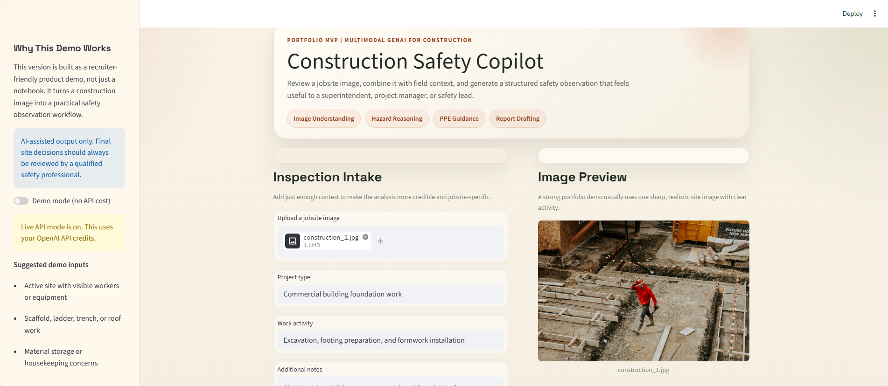
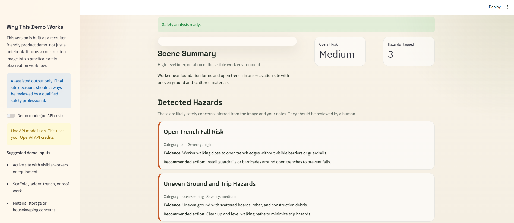
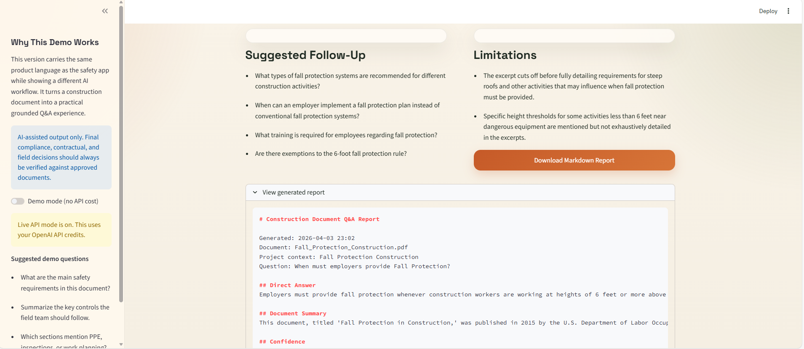

# Construction Safety Copilot

Construction Safety Copilot is a multimodal GenAI portfolio project for reviewing construction site photos and drafting a preliminary safety observation report.

It is designed to show applied AI skills in a real operations setting:

- image-based reasoning
- structured hazard analysis
- report generation
- user-facing product design
- construction domain knowledge

## App Preview

Inline demo preview:


Full recording: [View the demo video](assets/demo-recording.mp4)

### Inspection Intake



### Safety Analysis Results



### Report Output



## What It Does

Upload a construction site image and provide light project context such as work activity and site notes. The app generates:

- overall site risk level
- scene summary
- likely hazards and recommended actions
- PPE recommendations
- supervisor follow-up questions
- toolbox talk points
- downloadable Markdown report

## Demo Mode And Live Mode

The app now supports two ways to run:

### Demo Mode

Best for:

- portfolio demos
- recruiter walkthroughs
- development without API cost
- situations where billing or quota is not available

What it does:

- does not call the OpenAI API
- generates a realistic sample safety analysis
- lets you demonstrate the full product flow for free

### Live API Mode

Best for:

- real image analysis
- testing multimodal prompts
- validating the end-to-end AI workflow

What it does:

- sends the uploaded image and notes to the OpenAI API
- returns a structured safety observation from the model
- uses API credits

## Why This Project Is Strong For AI Jobs

This repo shows more than experimentation in notebooks. It demonstrates:

- multimodal AI product thinking
- prompt design for structured outputs
- a practical GenAI workflow
- domain-specific reasoning in construction safety
- a usable interface that can be discussed in interviews

## Tech Stack

- Python
- Streamlit
- OpenAI Responses API
- Pydantic
- python-dotenv

## Project Structure

```text
.
|-- app.py
|-- requirements.txt
|-- .env.example
|-- README.md
|-- examples
|   |-- README.md
|   |-- demo_case_01.md
|   `-- demo_case_02.md
`-- src
    |-- __init__.py
    |-- openai_client.py
    |-- reporting.py
    `-- schemas.py
```

## Setup

1. Create and activate a virtual environment.
2. Install dependencies:

```bash
pip install -r requirements.txt
```

3. Copy `.env.example` to `.env` and add your API key:

```env
OPENAI_API_KEY=your_api_key_here
OPENAI_MODEL=gpt-4.1-mini
```

4. Start the app:

```bash
streamlit run app.py
```

## Recommended Usage

### If you want a free demo

1. Start the app
2. Leave `Demo mode (no API cost)` turned on
3. Upload a construction image
4. Walk through the generated report as a product demo

### If you want real AI analysis

1. Add a valid OpenAI API key to `.env`
2. Make sure API billing is active
3. Turn off Demo Mode in the sidebar
4. Upload an image and run analysis

## Example Demo Cases

The [examples/README.md](C:\Users\rsamsami\Documents\Playground\examples\README.md) file includes sample demo scenarios you can use in presentations.

Included example outputs:

- [demo_case_01.md](C:\Users\rsamsami\Documents\Playground\examples\demo_case_01.md)
- [demo_case_02.md](C:\Users\rsamsami\Documents\Playground\examples\demo_case_02.md)

## Portfolio Positioning

This project can be described as:

`A multimodal AI copilot for construction site hazard review and safety reporting from images and field context.`

You can also position it on your resume as:

- Built a multimodal GenAI application for construction site safety review using Streamlit, structured outputs, and image-aware LLM prompting
- Designed a low-cost demo mode and live API workflow to support product demos, development, and recruiter-facing portfolio presentation
- Generated structured hazard summaries, PPE guidance, follow-up questions, and safety reports from jobsite images and notes

## Notes

- This tool provides an AI-assisted preliminary observation, not a certified inspection.
- The model may be uncertain when the image is blurry, incomplete, or lacks enough site context.
- Demo Mode is useful when API quota is limited.

## Suggested Next Versions

### Version 1.1

- add sample screenshots to the README
- export polished PDF reports
- add saved inspection history
- improve risk tagging visuals

### Version 2

- add object detection overlays
- map outputs to OSHA-style risk categories
- compare observations across time

## Source Notes

The implementation uses the OpenAI Responses API with image input and structured outputs. Official references:

- [Images and vision](https://platform.openai.com/docs/guides/images-vision)
- [Structured outputs](https://platform.openai.com/docs/guides/structured-outputs)
