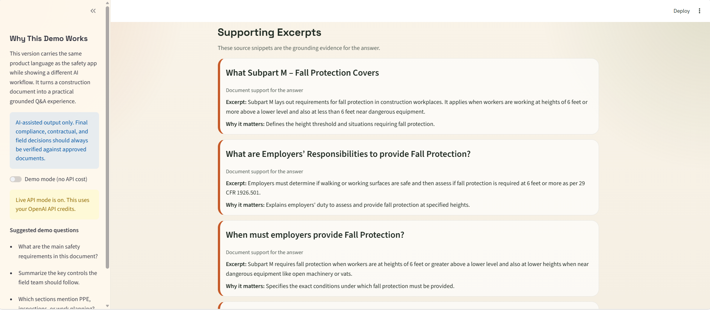

# Construction Docs Copilot

Construction Docs Copilot is a document intelligence portfolio project for uploading construction documents and asking grounded questions in plain English.

It is designed to show applied AI skills in a practical operations setting:

- document Q&A
- grounded LLM answers
- source-backed reasoning
- report generation
- user-facing product design
- construction domain relevance

## App Preview

Portfolio preview:


Full recording: [View the demo video](assets/demo-recording.mp4)

### Document Intake


### Grounded Answer Results


### Supporting Excerpts



### Report Output


## What It Does

Upload a project document such as a safety manual, method statement, specification excerpt, or site instruction and ask a plain-English question. The app generates:

- direct answer to the question
- organized answer breakdown
- supporting source excerpts
- suggested follow-up questions
- limitations and uncertainty notes
- downloadable Markdown report

## Demo Mode And Live Mode

The app supports two ways to run:

### Demo Mode

Best for:

- portfolio demos
- recruiter walkthroughs
- development without API cost
- situations where billing or quota is not available

What it does:

- does not call the OpenAI API
- generates a realistic sample answer
- lets you demonstrate the full product flow for free

### Live API Mode

Best for:

- real document Q&A
- testing grounded prompt workflows
- validating the end-to-end AI experience

What it does:

- extracts text from uploaded documents
- sends the extracted document text and question to the OpenAI API
- returns a structured answer with supporting excerpts
- uses API credits

## Why This Project Is Strong For AI Jobs

This repo demonstrates more than a generic chatbot. It shows:

- retrieval-style document workflows
- grounded answer design
- practical enterprise AI patterns
- prompt design for structured outputs
- multimodal-ready product thinking for enterprise document use cases
- a usable interface that can be discussed in interviews

## Tech Stack

- Python
- Streamlit
- OpenAI Responses API
- Pydantic
- PyPDF
- python-dotenv

## Supported File Types

- PDF
- DOCX
- TXT
- Markdown

## Project Structure

```text
.
|-- app.py
|-- requirements.txt
|-- .env.example
|-- README.md
`-- src
    |-- __init__.py
    |-- document_utils.py
    |-- openai_client.py
    |-- reporting.py
    `-- schemas.py
```

## Setup

1. Create and activate a virtual environment.
2. Install dependencies:

```bash
pip install -r requirements.txt
```

3. Copy `.env.example` to `.env` and add your API key:

```env
OPENAI_API_KEY=your_api_key_here
OPENAI_MODEL=gpt-4.1-mini
```

4. Start the app:

```bash
streamlit run app.py
```

## Recommended Usage

### If you want a free demo

1. Start the app
2. Leave `Demo mode (no API cost)` turned on
3. Upload a PDF, DOCX, TXT, or Markdown construction document
4. Ask a realistic project question
5. Walk through the grounded answer and source excerpts

### If you want real AI answers

1. Add a valid OpenAI API key to `.env`
2. Make sure API billing is active
3. Turn off Demo Mode in the sidebar
4. Upload a supported document and ask a question

## Example Demo Flow

Suggested demo file:

- `Fall_Protection_Construction.pdf`

Suggested demo question:

- `When must employers provide Fall Protection?`

Strong expected outcome:

- summary of the OSHA document
- direct answer describing the 6-foot rule
- grounded excerpts tied to Subpart M
- follow-up questions about systems, exceptions, and training

## Example Questions

- What are the fall protection requirements?
- Summarize confined space controls.
- Which sections mention PPE or scaffolding?
- What inspections are required before starting work?

## Portfolio Positioning

This project can be described as:

`A construction document intelligence copilot that answers questions from uploaded specs, safety manuals, and method statements using grounded AI outputs.`

You can also position it on your resume as:

- Built a document intelligence application for construction workflows using Streamlit, structured outputs, and grounded LLM prompting
- Designed a recruiter-friendly demo mode and live API workflow for document Q&A against uploaded project files
- Generated source-backed answers, follow-up questions, and report-ready summaries from construction documents in plain English

## Notes

- This tool is an AI-assisted document review, not a substitute for contract review, legal interpretation, or formal compliance review.
- Output quality depends on the quality and clarity of the uploaded text.
- Very large documents are clipped before sending to the model in this MVP version.
- Demo Mode is useful for portfolio walkthroughs, but Live API Mode is what produces real grounded answers from the uploaded file.

## Demo File

Use [examples/fall-prevention-demo.md](C:\Users\rsamsami\Documents\Playground\examples\fall-prevention-demo.md) if you want a ready-to-run sample document for portfolio demos.

## Suggested Next Versions

### Version 1.1

- add chunked retrieval instead of simple text clipping
- support DOCX uploads
- highlight matching sections more precisely
- save question history per document

### Version 2

- compare multiple project documents
- add citation anchors to exact pages or clauses
- support project-specific knowledge bases across many files

## Source Notes

The implementation uses the OpenAI Responses API with structured outputs and local document text extraction.
